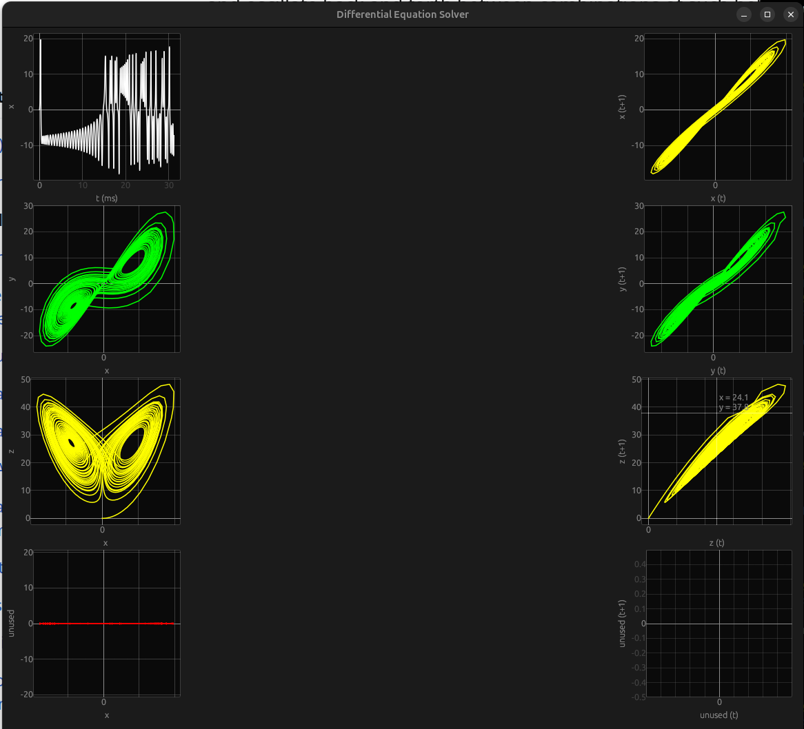

# ODE-RUST
RUST implementation of realtime ODE visualizations.

## To run

```bash
cargo run 
```

## Plots:

- Time series plots of first state
- Phase portraits of hidden states
- Poincare plots of all states

GUI will look like this:



## Configuration

Configuration is done in `config.ini`.

